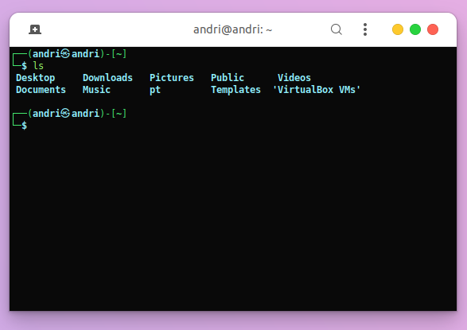
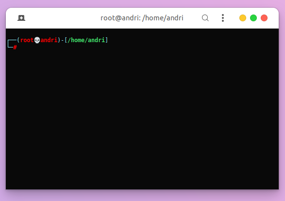

# zshrc-kali-linux-
kali linux terminal theme


<hr>


# howto setup 

* <a href="https://ohmyz.sh/#install">Install ohmy zsh<a/> or go to <a href="https://github.com/ohmyzsh/ohmyzsh">Github oh my zsh</a> to read the documentation

* go to bash terminal then copy

```bash
gedit .zshrc
```

Copy the zshrc code above or you can replace the file you downloaded above to your home folder

